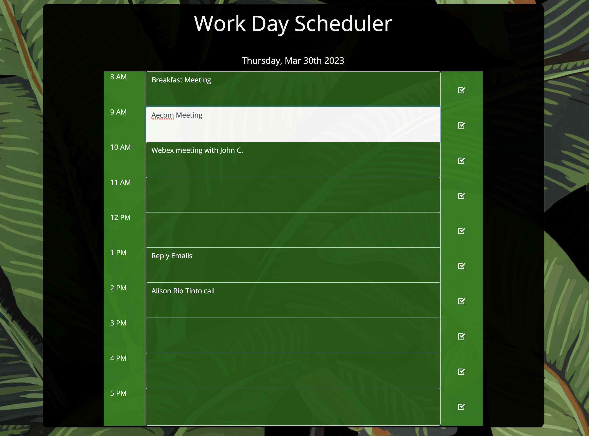

# Work Day Scheduler Starter Code

## Description
This application uses third-party API and JavaScript to create a calendar-style scheduler allowing users to save events for each hour of the day. This app will run in the browser and feature dynamically updated HTML and CSS by using jQuery.

## Table of Content
- [Installation](#installation)
- [Usage](#usage)
- [License](#license)
- [Contributing](#contributing)
- [Tests](#tests)
- [Questions](#questions)

## Installation

This application does not require installation.

## Usage

This application allows users to choose a time slot to enter a task. These tasks are stored in local storage so they are still accessible even when the application is refreshed. Current date is displayed on the top of the application and the times are color coded to let the user know when an event has passed, current, or in the future.
Please view live Git Hub https://vpolier.github.io/DayScheduler/

## License

This project is license under MIT

## Contributing

Contributors should read the installation section.

## Tests

There are no tests for this application.

## Questions 

If you have any questions about this projects, please contact me directly at vpolier81@gmail.com. You can view more of my projects at https://github.com/vpolier